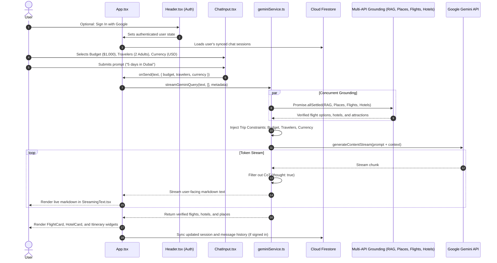

# travAI System Context & Architecture Directory

## 1. Executive Summary
**travAI** is a multi-agent travel intelligence platform built to eliminate hallucinations in automated travel planning. By utilizing a hybrid grounding pipeline, travAI validates destinations, physical points of interest (POIs), flight routings, hotel lodging, and regional cultural nuance before presenting a generated itinerary to the user.

### Core Paradigms
- **BYOK (Bring Your Own Key):** All Google Gemini API inference is performed client-side using user-supplied API keys stored exclusively in `localStorage['travai_gemini_api_key']`.
- **Lightweight Authentication & Cloud Sync:** Users can sign in using Google via Firebase Authentication. Sessions and chat messages sync seamlessly to Cloud Firestore under `users/{uid}/chats`, with a fallback to `localStorage['travai_sessions']` for guest travelers.
- **Dynamic Prompt Metadata Pipeline:** The user's chosen budget tier, traveler count, and active currency from the UI pills are automatically injected into the AI system instruction, eliminating the need to retype trip constraints.
- **Non-Blocking Multi-Source Grounding:** Queries trigger parallel, resilient fetches against vector retrieval (Pinecone RAG), geographical open data (Geoapify Places v2 + OpenStreetMap Overpass), real-time flight inventory (RapidAPI AeroDataBox), and hotel lodging (RapidAPI Booking.com).
- **Anti-Hallucination Strict Mode:** The LLM is strictly constrained via system instruction to cite only verified entities and real coordinates, explicitly stating when inventory is absent rather than inventing details.
- **Neo-Brutalism:** A distinct high-contrast UI language combining thick borders, zero-blur drop shadows, and vibrant color-coded functional tags.

---

## 2. Workspace Directory Map

```text
travAI/
├── README.md                           # Project introduction
├── rules.md                            # Architectural constraints & code hygiene rules
├── context.md                          # Living system context, data contracts & changelog
├── DEMO_TRACK_GUIDE.md                 # Open Track competition pitch & demo guide
└── vite-project/                       # Application workspace
    ├── index.html                      # Entry HTML with custom fonts & root div
    ├── package.json                    # Project dependencies (React 19, Tailwind v4, Firebase)
    ├── vite.config.js                  # Vite configuration with React & Tailwind v4
    ├── tsconfig.json                   # TypeScript configuration
    ├── vercel.json                     # Vercel serverless function & routing configuration
    ├── .env.example                    # Sample environment variables
    ├── .env.local                      # Local server secrets (PINECONE_API_KEY, GEOAPIFY_API_KEY, etc.)
    ├── api/                            # Vercel Serverless Functions (Node ESM runtime)
    │   ├── flights/
    │   │   └── search.ts               # POST /api/flights/search (RapidAPI AeroDataBox + matrix)
    │   ├── hotels/
    │   │   └── search.ts               # POST /api/hotels/search (RapidAPI Booking + matrix)
    │   ├── places/
    │   │   └── search.ts               # POST /api/places/search (Geoapify Places v2 + OSM Overpass)
    │   └── rag/
    │       ├── ingest.ts               # POST/GET /api/rag/ingest (Pinecone vector indexing)
    │       └── search.ts               # POST/GET /api/rag/search (Pinecone semantic search)
    ├── data/
    │   └── japan.md                    # Seed travel knowledge base
    ├── server/
    │   ├── scripts/
    │   │   └── seedKnowledge.ts        # CLI seeding tool (npm run seed:knowledge)
    │   └── services/
    │       ├── envHelper.ts            # Serverless environment variable & .env.local resolver
    │       ├── flightsService.ts       # RapidAPI flight provider & schedule matrix
    │       ├── hotelsService.ts        # RapidAPI hotel provider & lodging matrix
    │       ├── pineconeService.ts      # Pinecone client & integrated embeddings search
    │       └── placesService.ts        # Geoapify Places v2 & Overpass OSM hybrid search
    └── src/
        ├── App.tsx                     # Top-level state machine, Firebase auth & session sync
        ├── main.tsx                    # React 19 application mount
        ├── index.css                   # Neo-Brutalist design tokens & Tailwind utilities
        ├── components/                 # UI components
        │   ├── ActivityCard.tsx        # Activity item representation
        │   ├── AIMessage.tsx           # Assistant message layout (cards, actions, stream)
        │   ├── ApiKeyModal.tsx         # BYOK key management & validation modal
        │   ├── ChatInput.tsx           # Textarea with Wallet icon & dynamic currency budget pills
        │   ├── DestinationComparison.tsx # Side-by-side comparison table
        │   ├── ExportModal.tsx         # Export itinerary to Markdown / PDF
        │   ├── FlightCard.tsx          # Real-time flight option card
        │   ├── FollowUpSuggestions.tsx # Clickable prompt suggestions
        │   ├── Header.tsx              # Brand logo, model switcher, Google Sign-In & key indicator
        │   ├── HotelCard.tsx           # Hotel option card
        │   ├── Itinerary.tsx           # Day-by-day collapsible schedule
        │   ├── LandingView.tsx         # Starter view with prompt templates
        │   ├── LoadingState.tsx        # Neo-brutalist pixel loader
        │   ├── Sidebar.tsx             # Saved session drawer & currency switcher (localStorage synced)
        │   ├── SourcesPanel.tsx        # Verified reference links
        │   ├── StreamingText.tsx       # Custom markdown parser with pills & bolding
        │   ├── ThinkingState.tsx       # Collapsible reasoning trace animation
        │   └── UserMessage.tsx         # User chat bubble
        ├── data/
        │   └── mockData.ts             # Demo and fallback mock datasets
        ├── services/
        │   ├── chunker.ts              # Markdown document splitter with frontmatter
        │   ├── firebase.ts             # Firebase Auth & Cloud Firestore sync service
        │   └── geminiService.ts        # Gemini streaming client, intent check & multi-API fetch
        └── types/
            └── index.ts                # TypeScript data interfaces
```

---

## 3. TypeScript Data Contracts

All data flowing between the API layer, Gemini grounding, and UI components complies with the following schemas in `src/types/index.ts`:

```typescript
export interface FlightItem {
  id: string;
  airline: string;
  flightNo: string;
  logoUrl?: string;
  from: string;
  fromCode: string;
  fromTime: string;
  to: string;
  toCode: string;
  toTime: string;
  duration: string;
  stops: string;
  price: string;
  currency: string;
  class: string;
  highlights: string[];
}

export interface HotelItem {
  id: string;
  name: string;
  location: string;
  city: string;
  rating: number;
  reviewsCount: number;
  pricePerNight: string;
  totalPrice: string;
  currency: string;
  image: string;
  tag: string;
  highlightQuote: string;
  amenities: string[];
}

export interface ActivityItem {
  id: string;
  timeSlot?: string;
  title: string;
  category: 'food' | 'culture' | 'sightseeing' | 'transport' | 'shopping' | 'relaxation';
  duration: string;
  cost: string;
  rating: number;
  description: string;
  location: string;
  tags: string[];
}

export interface DestinationComparison {
  id: string;
  destination: string;
  country: string;
  flag: string;
  flightCost: string;
  hotelCost: string;
  foodCost: string;
  transportCost: string;
  totalEstCost: string;
  weather: string;
  vibe: string;
  bestFor: string;
  recommendationBadge?: string;
  pros: string[];
  cons: string[];
}

export interface ChatMessage {
  id: string;
  role: 'user' | 'assistant';
  content: string;
  timestamp: string;
  isStreaming?: boolean;
  sources?: Source[];
  flights?: FlightItem[];
  hotels?: HotelItem[];
  activities?: ActivityItem[];
  itinerary?: ItineraryDay[];
  comparison?: DestinationComparison[];
  followUpSuggestions?: string[];
  costSummary?: {
    flights: string;
    hotels: string;
    activities: string;
    transport: string;
    total: string;
    budget: string;
    withinBudget: boolean;
  };
}

export interface ChatSession {
  id: string;
  title: string;
  createdAt: string;
  updatedAt: string;
  messageCount: number;
  preview: string;
}
```

---

## 4. End-to-End Grounded Data Flow & Metadata Pipeline



---

## 5. API Directory

| Endpoint | Method | Provider / Engine | Primary Data Returned | Fallback Mechanism |
| :--- | :--- | :--- | :--- | :--- |
| `/api/rag/search` | POST/GET | Pinecone Vector Database (`travai-knowledge`) | Verified cultural & regional travel knowledge chunks | Empty matches array; Gemini uses general knowledge |
| `/api/places/search` | POST/GET | Geoapify Places API v2 + OpenStreetMap (Overpass API) | Verified POIs, GPS coordinates, categories, preview images, ActivityItem[] | Geoapify with OSM Overpass mirror failover & curated city fallback |
| `/api/flights/search` | POST/GET | RapidAPI AeroDataBox | Verified carrier flights, flight numbers, duration, live pricing | Curated global route schedule matrix covering top travel hubs |
| `/api/hotels/search` | POST/GET | RapidAPI Booking.com | Verified hotels, addresses, star ratings, amenities, photos | Curated high-rating lodging matrix covering top travel hubs |
| `/api/rag/ingest` | POST/GET | Local Markdown files (`data/japan.md`) | Ingests and embeds knowledge into Pinecone | Returns summary of indexed documents |

---

## 6. Environment Variable Registry

| Variable Name | Target Scope | Description | Secret? |
| :--- | :--- | :--- | :--- |
| `GEOAPIFY_API_KEY` | Server (`.env.local` / Vercel) | Key for Geoapify Places v2 and Geocoding APIs | Yes (Server Secret) |
| `RAPIDAPI_KEY` | Server (`.env.local` / Vercel) | Key for RapidAPI (AeroDataBox flights & Booking.com hotels) | Yes (Server Secret) |
| `PINECONE_API_KEY` | Server (`.env.local` / Vercel) | Pinecone vector DB authentication | Yes (Server Secret) |
| `PINECONE_INDEX_NAME` | Server (`.env.local` / Vercel) | Target Pinecone index name (defaults to `travai-knowledge`) | No |
| `VITE_FIREBASE_API_KEY` | Client (`.env.local` / Vercel) | Firebase Web SDK API key for Google Auth & Firestore | Public client identifier |
| `VITE_FIREBASE_AUTH_DOMAIN` | Client (`.env.local` / Vercel) | Firebase Web SDK authentication domain | Public client identifier |
| `VITE_FIREBASE_PROJECT_ID` | Client (`.env.local` / Vercel) | Firebase project ID for cloud sync | Public client identifier |
| `VITE_GEMINI_API_KEY` | Client (`.env.local` fallback) | Optional fallback client key for Gemini inference (BYOK first) | Client fallback |

---

## 7. Living Changelog

| Date | Author / Agent | Changes Made |
| :--- | :--- | :--- |
| 2026-09-05 | Antigravity AI | Initialized `rules.md` and `context.md`. |
| 2026-09-05 | Antigravity AI | Integrated Tourist POIs (OpenTripMap/Wikimedia + Overpass), Flight Search API, and Hotel Recommendations API. |
| 2026-09-05 | Antigravity AI | Connected Multi-API grounding into client `streamGeminiQuery()` with `Promise.allSettled` and anti-hallucination prompt. |
| 2026-09-05 | Antigravity AI | Created `DEMO_TRACK_GUIDE.md` for Open Track evaluation. |
| 2026-09-05 | Antigravity AI | Replaced hardcoded `$` in `ChatInput.tsx` with `<Wallet />` icon and dynamic currency-based budget options. |
| 2026-09-05 | Antigravity AI | Implemented automatic prompt metadata injection (`Trip Constraints: Budget, Travelers, Currency`) in `geminiService.ts`. |
| 2026-09-05 | Antigravity AI | Synchronized active currency with `localStorage['travai_currency']` and fixed "Start New Plan" session preservation in `App.tsx`. |
| 2026-09-05 | Antigravity AI | Integrated Firebase Authentication (Google popup) and Cloud Firestore session synchronization (`users/{uid}/chats`) with offline guest fallback. |
| 2026-09-05 | Antigravity AI | Replaced OpenTripMap with Geoapify Places API v2, integrated RapidAPI for live flight schedules and hotel lodging with resilient matrix fallbacks, verified Firebase Auth client safety, and documented environment variable registry. |
